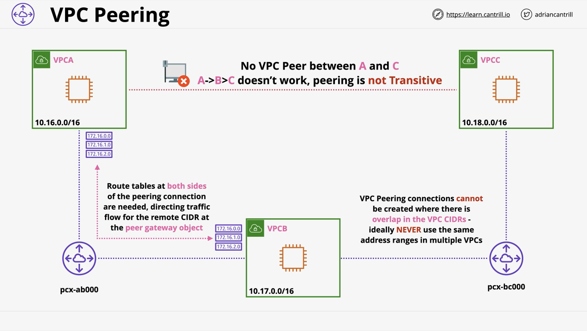

## Associate Fundamentals

> [!info] Solutions Architect Associate (SAA) fundamentals needed for Professional (SAP) exam

### AWS Region Basics

- Region is a full deployment of infrastructure
	- Geographic seperation
	- Data in a region doesn't generally leave that region
	- Remember stuff in regions follow the laws of the country they are hosted in
- Edge Location is a CloudFront cache of data so it can be close to users
- AZs are conceptually like a datacenter
- Globally resilient services = IAM, Route53
	- It would take the world to fail to experience an outage

###  VPCs

#### Default VPC

- VPC is a regional service
	- Default VPC comes pre-configured in a very specific way
		- 1 Subnet per AZ and default CIDR range 172.31.0.0/16
		- Can be deleted and re-created
		- Some services depend on the default VPC existing
		- Default VPC has public ip allocation + addressing enabled by default
	- VPC spans Multi-AZ
		- Each subnet reflects an AZ
		- /20 subnet allocated to each AZ

#### Custom VPCs

Where possible, we avoid using the default VPC
- Too limited

Deciding on an IP plan in advance is one of the most important decisions
- What size should the VPC be?
- Are there any networks we can't use?
- What other ranges exist? 
	- VPCs, Cloud, On-premises, Partners & Vendor
- Try to predict the future
	- How many regions will the business operate in?
- VPC Structure
	- Tiers
	- Resilience

For number of AZs
- Start with 3, it works for all regions
- +1 spare

Choosing CIDR ranges
- Say we have Web, Application, Database, Spare tiers
	- We need to split a CIDR range into 4 smaller networks
		- Then one subnet per tier
		- So we're dividing our VPC into 16 smaller networks
		- If we start with a /16 this means we need /20 for each network
	- We also need to factor in number of AWS accounts per regions, e.g. Dev, UAT, Live

==Exam: Each time we increase the prefix, it creates 2 smaller networks==

https://d1.awsstatic.com/whitepapers/aws-amazon-vpc-connectivity-options.pdf

Default or dedicated tenancy
- Be careful with this option
- Dedicated Tenancy means any resources in the VPC need to be on dedicated hardware

Limits:
- Min /28 Max (16 IPs) 
- Max /16 (65,536 IPs)
- Optional secondary IPv4 blocks (up to 5)

DNS:
- Provided by Route53
- Base IP + 2
- Setting: Enable DNS support can be on or off
- Setting: Enable DNS hostnames - can be on or off
#### VPC Subnets

- A subnet can only be in one AZ
- Can't overlap with any other subnets
- Some IPs are reserved
	- 5 to be precise
- Example: 10.16.16.0/20
	- Nothing can use the first address in a network (10.16.16.0)
	- Network + 1 address = VPC router (10.16.16.1)
	- Network + 2 for DNS (10.16.16.2)
	- Network + 3 for Future use (10.16.16.3)
	- Last IP in subnet is broadcast address (10.16.31.255)
- Each VPC has a DHCP option set linked to it
- Other settings: Enable Public IPs (IPv4 and IPv6)

[Handy Subnet Calculator](https://www.site24x7.com/tools/ipv4-subnetcalculator.html)
#### VPC Peering

- Encrypted
	- even across regions via AWS global secure network
- Between 2 VPCs only
- Works cross-region and cross-account
- Can enable DNS for Public Hostnames -> Private IPs
- Security Groups in same regions can reference Security Groups
- Connection is NOT transitive
	- You can't route through interconnected VPCs, you have to peer them all

### IAM - Identity and Access Management

IAM users
- 5000 user limit per account
- Authenticate via username/password
- Or Access Keys

Amazon Resource Names (ARNs)
- Uniquely identify a resource in an account
- Triple colon in S3 ARN is because we're omitting region and account-id (global service)

Inline policy: Individual per user - high overhead
Managed policy: Attached to a user - low overhead

We also have
- AWS managed policies (not editable)
- Customer managed policies

Use inline policy for exceptions only

Identity vs Resource policies:
- Identity Policies control what an identity can access
	- Can only control access for identities in your account
- Resource Policies control who can access a resource
	- Can allow access for other accounts
	- Can allow/deny anonymous principals
	- Extra "Principal" part of policy
#### IAM Groups

> tldr; Containers, used solely for manage IAM users

Limit of 300 groups per account but can be increased

Limitations:
- Can't login to a group
- IAM groups have no credentials of their own
- No nesting of groups
- Can't reference groups in resource policies

Groups help us organise users into teams
- Make organising large numbers of users easier
- Groups can have policies attached to them
- Group policies are combined with individual permissions

==Exam: There is no all users group by default==
#### IAM Roles

> tldr; Another type of principal in an account

Temporary credentials
- We assume the role
- Trust policies determine who can assume the role
- Once assumed STS generates temporary access credentials

Suited for scenarios with an unknown number of users

A role represents a temporary level of access, not a person

When should we use roles?
- AWS services use them on your behalf
	- e.g. a Lambda function
	- Trust policy trusts the Lambda service
	- When function runs it uses STS to generate temporary credentials
	- Benefits:
		- Avoids hardcoding access keys in lambda function
		- Means we don't need to rotate credentials
		- Only assigning temporary credentials instead of permanent
		- If we run 500 functions we don't need credentials for each
- Break glass
	- Only use the role in exceptional circumstances
- SSO / Federated access
	- Source of truth is the external service
	- We don't want or need to manage the users separately in AWS
- More than 5000 users
- If we want to access resources in another AWS account
#### Service Linked Roles

> tldr; AWS roles that are pre-defined by a service

You can't delete these until they are no longer required
#### PassRole

> tldr; Role separation: One group can create roles, another group can use the role

PassRole permission allows this
### S3 - Simple Storage Service
> tldr; core global storage platform, should be your default service for storage

Public Service
- Multi User access by design
- Can be accessed by GUI, HTTP, CLI, API

Buckets and Containers
- Storage is object based
	- Not file
	- Not block
		- Can't be mounted
- Key:Value
	- Object Key is like a filename
	- Value is the file data
- Everything is stored at the root level, not in folders
	- Illusion of folders is based on the filename
	- These are known as prefixes

Limits:
- Bucket names are globally unique - across all regions and AWS accounts
- 5TB limit
- Unlimited number of objects
- 3-63 character bucket names
- Name must start with lowercase letter or number
- 100 buckets per account / 1000 hard limit

#### Bucket Permissions

Bucket Policies:
- Needed for external access, i.e. public access
- Can restrict to IPs
- Cross account access:
	- External account's Identity policy + Bucket resource policy

ACLs:
- Outdated method of granting access
- Don't bother, just use bucket policies

Block Public Access:
- Further level of security that override bucket policies for anonymous principals
- Fail-safe to prevent mistaken access

Use identity when:
- Controlling different resources in the same permissions group
- Preference for IAM
- Same account

Use Bucket when:
- Just controlling S3
- Anonymous or cross-account
#### Static Hosting

Great for out of band pages (e.g. main website down) and offloading (reducing impact on main web server)

For custom domains bucket name needs to match domain name
#### Object Versioning & MFA Delete

Not enabled by default

Once enabled it can't be disabled, only suspended
- Only way to get cost down to 0 is to delete bucket which clears old versions

When versioning is disabled, only the object key identifies an object, id field is null

When versioning is enabled, an version_id field is used to identify an object

When we delete an object, we add a new version with a delete marker
- it's not really deleted
- but we can fully delete an item by specifying the version when we delete
- deleting the delete market 'undeletes' the object
	- this unhides the object in the UI

MFA delete
- Enabled within versioning config
- We provide device serial + code from MFA when we perform API calls

#### Performance

> tldr; by default S3 uploads an object in one stream, recovery is a full re-upload

Multi-part upload improves upload time
- Single Put upload is limited to 5GB
- minimum size is 100MB
- use it when you get above 100MB, lots of benefits
- maximum of 1000 parts
- Improves transfer rate (multi-steam)
- And reliability (if upload gets interrupted)

Transfer acceleration
- Uses AWS edge network locations
- Better than going through normal networks on the internet where routing can be unpredictable
- Think express train vs bus/train/bus public internet

#### S3 Events

> tldr; When enabled a notification is generated when a certain thing happens in a bucket

Can trigger on different actions:
- Put
- Post
- Copy
- CompleteMultiPartUpload
- Delete
- Restore
- Replication

Events can go to:
- Lambda
- SQS Queues
- SNS topics

We need resource policies to allow S3 to interact with these services

EventBridge is a more modern and capable version of this

#### S3 Access Logs

> tldr; best efforts process to log access to a target s3 bucket

You need to manage deleting the logs manually

#### MRAP

Single S3 endpoint distributes to closest bucket to end user

### CloudWatch

> tldr; Public Service for monitoring

- Metrics
- CloudWatch Logs
- CloudWatch Events - event hook

CloudWatch Alarms -> Trigger stuff

Doesn't capture anything inside an instance
- For this we need CloudWatch Agent
- Includes Disk, Network, Memory metrics
- Also includes instance specific system logs and application logs
- Can use parameter store to store Cloudwatch Agent settings

![[Images/ec2_logging.png]]
### VPC Router

VPC router = Highly Available device present in every VPC

- Network + 1 address in a subnet
- If Instance in Subnet A wants to communicate with one in Subnet B, VPC router handles it
- Has rules for when data leaves the subnet
  - This is the route table
- We can create custom route table
  - Only one route table can be active in a subnet -> If custom, you disassociate the main RT

Cost of VPC: Free

### Internet Gateway (IGW)

IGW is Resilient by default - only need 1 for all AZs

Can only have 0 or 1 IG in a VPC

The term Public Subnet means:

- Add IGW to VPC
- Custom route table
  - Default route 0.0.0.0/0 goes to IGW
- Configure subnet to allocate IPv4 address by default

IGW handles forwarding EC2 instance's private IP to Public IP for any outgoing requests

- For IPv4
  - The EC2 instance does not actually have a public IP
  - The EC2 instance does not know about a public IP at all!

- For iPv6
  - Addresses are publicly routable by default so the instance does know about it

Bastion hosts often used as only way into a VPC

Cost of IG: Free (only cost is internet traffic)

### NAT gateway (NATGW)

Network Address Translation

Outgoing traffic only
- Only works for IPv4 traffic
- Many Private IPs -> One out-going IP address

Depends on IGW
- You need an IGW to use a NAT Gateway
- You need a public subnet for the IGW to live in
- NAT gateway also goes in public subnet -> It then does the talking through IGW
- NAT gateway default route is the IGW

NAT GW also makes use of Elastic IPs

NAT gateway records source IPs, Ports, in a translation table

Not Regionally resilient!
- Only HA for the AZ they are in (much less resilient than IGW)
- Multiple NAT GWs can be needed for HA and / or throughput (each one scales to 45Gbps)
- True HA, you need 1NATGW per public subnet per AZ

Cost of NATGW:
- Hourly charge
- Data processing charge

NAT gateway doesn't support security groups - only NACLs

### **NAT instance**

EC2 instance doing what a NATGW does

Can be cheaper than a NATGW

Can use EC2 instance for other purposes (e.g. bastion host)

If you go for a NAT EC2 instance, you need to disable source/destination checks on EC2 instance

### Egress Only Internet Gateway

Like an Internet Gateway but
- For IPv6 traffic only
- Outbound traffic only

IPv6 addresses don't have a private/public concept, unlike IPv4

An internet gateway doesn't do the trick for IPv6 instances, as it allows incoming and outgoing connections thereby exposing instances to the internet

Free
### Site to Site VPN

Speed limit: 1.25Gbps/s with 2 tunnels
VGW is also limited to 1.25Gbps over all connections

Pros:
- Quick to set up compared to DX
Cons:
- Latency considerations: Variable over public internet
- Uses existing internet connection, watch out for bandwidth limits

- VGW
	- Links VPC to AWS Public Zone
	- Highly available
		- Multiple interfaces in Public Zone
		- Each one connects to CGW - tunnel redundancy
- CGW
	- Logical representation via AWS resource
	- Physical side is the router in customer datacenter
	- 1 CGW isn't HA if the customer side router fails we lose the connection
		- We resolve this by adding a second CGW preferably in a different physical location
		- VGW adds two new tunnels to the new CGW

Static VPN = We have to tell AWS about IP ranges for on-prem and the on-prem CGW about the AWS cidr ranges
- Static VPN is quite limited but most routers support it

Dynamic VPN = Uses BGP to auto populate routes
- Create a relationship between VGW and CGW then it learns the routes
- Route propagation makes solution fully dynamic
	- While any VPN connection is added any learned routes are automatically added onto the route table

### EC2

> tldr; default compute service in AWS

Virtual Machines
- IAAS - Infrastructure As A Service
- Private by default
- Security Group = Mini firewall
- AZ resilient - Instance fails if AZ fails
- Different sizes and capabilities
- On-demand billing = per second
- Local on-host storage or EBS (network block storage)

What is EC2 good for?
- Long running compute
- Stuff that requires a traditional OS
- Server style applications
- Monolithic application stacks
- Migrating application workloads that require a server style environment

Instances cannot move between AZs
- EC2 and EBS are AZ specific services

Shared hosts & Dedicated hosts
- Dedicated hosts you are paying for the host itself
- No other charges for running instances on it

Instances stay on a host until
- Host fails or undergoes AWS maintenance
- Instance is stopped and started (not just restart)

Multiple states:
- Running = on
	- charged for cpu, memory, network, storage
- Stopped = off
	- no charges for cpu, memory, network
	- but still charged for storage
- Terminated = fully deleted
	- not reversible
	- no ongoing costs

AMI = the image of an EC2 instance
- AMI -> EC2 -> AMI

AMI Contents:
- Permissions:
	- Public
	- Owner
	- Explicit, specific AWS accounts allowed
- Root Volume
- Block Device Mapping

EC2 Bootstrapping:
- Via UserData
	- Accessed via metadata API
	- Instance queries the API on startup to check if a userdata script exists
	- No validation on userdata
		- If it fails the instance will still launch in a healthy state
		- User data somewhat risky in this way
	- Not secure
		- Don't use for passwords or longterm creds
	- Any changes are picked up on stop/start of instance
		- But only executed on launch
	- Limited to 16KB
	- Runs as root user
- Or build a custom AMI
	- Or a combination of both

UserData vs Custom AMI
- Userdata can take longer but is more flexible
- Custom AMI pre-built so spin up time can be faster, but not as flexible
- Optimal solution is a combination

EC2 virtualization more info:
https://www.brendangregg.com/blog/2017-11-29/aws-ec2-virtualization-2017.html

AWS Has custom hypervisor stack called Nitro

Terms:
- Emulated virtualization
	- Binary translation to translate privileged operations
	- Guest OS need no mods, but is very slow
	- Drivers though they were real devices, e.g. graphics card
- Paravirtualization
	- Guest OS has been modified to make usercalls instead of privileged system calls
	- Call hypervisor rather than hardware
	- Paravirtualizard drivers
	- Faster
- Hardware Assisted Virtualization
	- Physical hardware became virtualization aware
	- CPU knows virtualization exists
	- System calls are trapped by cpu
	- Redirected to Hypervisor
	- Faster but still slower for network / disk io
- SR-IOV
	- Hardware cards are virtualization aware
	- E.g. network card can present itself as separate cards per guest os
	- No translation needed
	- Physical access to card
	- In EC2 this powers Enhanced Networking

#### Networking Tips

Public DNS:
- Inside a VPC Public Hostnames are resolved to the Instance's private IP address
- Outside the VPC, they go to the IGW, which forwards them to the instance

Instances never have a public IP address directly assigned on the box, only the IGW knows about it and forwards it to the instance

Elastic IPs
- If an Elastic IP is removed, the instance gets a new public ip address, not the old one it had prior to EIP 
- Also Stop -> Start instance = New Public IP
	- To avoid, assign an Elastic IP address

ENIs (Elastic Network Interfaces)
- All instances have a Primary ENI
- And optionally a Secondary ENI
- This can be moved between instances (Primary can't)
- Trick for software licensing is to move secondary ENI to another instance (MAC address stays the same)
#### Status checks

2 high-level status checks per instance
- System status
	- Loss of power
	- Loss of network connectivity
	- EC2 host issues
- Instance status
	- Corrupt filesystem
	- Invalid IP address assigned, e.g. assigning a public ip address to an instance
	- OS level issues

EC2 can handle these events:
- Cloudwatch alarm for failed status checks
	- Alarm action: 
		- Recover (ec2 attempts to recover the instance, doesn't work on instances with instance store volumes)
		- Reboot
		- Stop (you might want to inspect logs)
		- Terminate (kill the instance and let the ASG provision a new one)
- Auto recovery moves instance to a new host
#### Shutdown vs Termination

- Shutdown is just normal power-off
	- However, it can be overridden to be the same as terminate
	- You might do this if you don't want stopped instances
- Termination deletes all data
- We can enable termination protection to stop this being possible
	- disableAPItermination instance attribute
- Termination protection useful for role seperation
#### Launch Templates vs Launch Configurations

> tldr; Similar, but Launch templates came after Launch Configurations and include extra capabilities

ASGs can utilize either type

Both allow the configuration of Ec2 instances to be defined in advance (image, storage, instance type, networking config, security groups, userdata etc)

Both are locked - non editable
- Launch templates allow versions
- Launch configurations don't

AWS recommend launch templates
- Extra features

Launch configurations:
- Used as part of ASGs only
- No editing
- No versions

Launch templates:
- Use in ASGs
- And create instances manually using the template

#### Instance Metadata

> tldr; A EC2 services provides data to instances

IP address: http://169.254.169.254 a.k.a. 169.254 repeated

Full URL: https://169.254.169.254/latest/meta-data

Instance can get information about:
- Environment
- Networking
	- e.g. Public IP, instance doesn't know this
- Authentication

Used by AWS to pass in temporary SSH keys
- EC2InstanceConnect does this

Metadata Service is
- Not encrypted
- Has no authentication

Queried via curl

<code>curl http://169.254.169.254/latest/meta-data/public-ipv4</code>
<code>curl http://169.254.169.254/latest/meta-data/public-hostname</code>

Or via helper tool 
- ec2-metadata
- http://s3.amazonaws.com/ec2metadata/ec2-metadata

More info:
[https://docs.aws.amazon.com/AWSEC2/latest/UserGuide/instancedata-data-retrieval.html](https://docs.aws.amazon.com/AWSEC2/latest/UserGuide/instancedata-data-retrieval.html)
[https://aws.amazon.com/code/ec2-instance-metadata-query-tool/](https://aws.amazon.com/code/ec2-instance-metadata-query-tool/)

#### Horizontal and Vertical scaling

Vertical: Bigger nodes
- Downtime during this resize
- Generally done during outage windows
- Not great if you need to react to sudden load fluctuations
- Finite cap - the largest instance size
- On the plus side - no need for application changes

Horizontal: More nodes
- As load increases we add nodes
	- And can remove them when load goes down
- Application needs to support running on multiple nodes
	- We need a load balancer
- Sessions are a **key**  consideration
	- Application support needed
	- Or external sessions
- No size limit
	- We can just keep adding instances
	- Smaller instances are cheaper
- More granular
	- 5 small instances + 1 more = 20% increase
	- Whereas moving to next size up is doubling capacity for vertical scaling

#### EC2 Instance Connect

A way of connecting to an instance via a public IP address without proving SSH keys

AWS permissions are used to log into instance
- Authentication is done via temporary keys supplied by EC2 instance metadata service

Connections come from EC2 Instance Connect service
- Need to allow the IP ranges in via SSH for the applicable region
- https://ip-ranges.amazonaws.com/ip-ranges.json

If the instance only has a private IP address 
- we need to add an EC2 Instance Connect Endpoint into the VPC

#### EC2 Instance Types

Instance Type influences a few things:
- ARM vs x86
- Resource Ratios
- Storage and Data Network Bandwidth
- Some instances come with GPUs

5 main categories
- General Purpose
	- Should be your default
- Compute Optimized
	- Latest CPUs, more CPU than memory
- Memory Optimized
	- More memory than CPU
- Accelerated Computing
	- Hardware GPU, FPGA
- Storage Optimized
	- Massive amounts of storage performance

Handy reference sites:
[https://aws.amazon.com/ec2/instance-types/](https://aws.amazon.com/ec2/instance-types/)
[https://ec2instances.info/](https://ec2instances.info/) - sortable list of instances

![[Images/ec2_decoding_instance_types.png]]

![[Images/ec2_instance_types.png]]
#### EC2 Instance Roles

> tldr; EC2 instance assumes a role and gets the associated permissions

Permissions are delivered via Instance Metadata

There's a 3rd piece: Instance Profile
- This is what the role is attached to
- The profile is attached to the instance

Handy feature: EC2 and STS renew credentials before they expire

==Exam tip: Always use roles over hardcoded credentials==
#### Enhanced Networking

> tldr; SR-IOV, handled by physical network card

Allows higher I/O and lower host CPU usage

More bandwidth (more packets / second) 

Usually enabled by default and supported by most modern hardware
#### Dedicated Hosts

> tldr; An EC2 host which is allocated entirely to you

Generally dedicated hosts are used for applications which use physical core/socket licensing

No charges for any instances running on the host

![[Images/ec2_dedicated_hosts_2.png]]

Nitro based hosts have more flexibility for varying sizes of different instance sizes

![[Images/ec2_dedicated_hosts.png]]

Limitations:
- Only certain AMI types
- No RDS instances
- Placement groups not supported
- Hosts can be shared with other accounts in organisation via RAM

[Comparison of Dedicated Hosts](https://aws.amazon.com/ec2/dedicated-hosts/pricing/)
#### EBS Optimized

> tldr; dedicated stack for EBS connections

Dedicated capacity provided for the instance for the storage, without interfering with other traffic

Most instances support it, it's normally enabled by default these days

On older instances, it's supported but costs $ to enable

#### AMIs (Amazon Machine Images)

> tldr; The image that is used to launch an EC2 instance 

AMIs are regional entities
- We can copy AMI between regions
- The copied AMI is effectively a new AMI with a different AMI ID

We can use pre-provided images or create out own

Includes OS and other attached volumes

Permissions:
- Public
- Private
- Your account or other accounts

Lifecycle:
- Launch
- Configure
- Create Image
	- Uses EBS snapshots
- Launch
	- Attached EBS volumes are created from snaps in the AZ you spin the instance up in

You cannot update an AMI, have to create a new one

### Elastic Block Storage (EBS)

> tldr; network block storage

- Generally presented to one EC2 instance only
- **Storage exists in 1AZ only**
- Resilient within the AZ
- Exception is 'multi-attach' but this requires special handling
- Persistent storage
- Can detach an EBS instance and attach to different EC2 instance in same AZ
- Can take a snapshot into S3
- Cross AZ/Region restore
	- Snapshot to S3
	- Copy this to another region
	- Restore snapshot to EBS in the new region

Different Storage types:
- SSD (GP)
- SSD (IO)
- HDD

Billing is per GiB/month based on total allocation (not used data)
- And in some cases performance

#### EBS Snapsots

tldr; Protect EBS and store data in multi-az, also copy it cross AZ/Region

Snapshot is full copy of data on volume 
- 10GB out of 40GB volume only takes 10GB
- Doesn't impact performance during snap
- Each snapshot is self sufficient
	- If we delete a snap future ones are still incremental

Snapshot restore
- Done lazily - fetched gradually from S3
- Requested blocks are fetched immediately but this is slower
- Fast Snapshot Restore (FSR) costs more but ensures immediately fast performance
- Another option is to do standard restore and use DD to fetch every block

Pricing is per GiB/Month (based on actually used data, not total volume size)
- You're only charged for the differences between each incremental snapshot
- E.g. First snap is 10GB, second is 1GB (changes), 3rd is 2 GB (more changes)
	- Total cost = 10+1+2.= 13GB for all 3 snaps

#### EBS Encryption

>tldr; Not enabled by default, but we can use KMS

Best practice: Use encryption by default

- EBS managed KMS key 
- Customer Managed KMS key
	- KMS DEK key
	- KMS doesn't encryption volume directly, it encrypts the Data Encryption Key
	- Each volume uses a unique Data Encryption Key
- Encryption flows through to snapshots too
	- Snapshots using customer managed KMS use same DEK as original volume
	- So do restored volumes from those snapshots
- Can't change a volume to NOT be encrypted
- OS doesn't know about the encryption
	-  No performance impact to using the encryption
### Elastic Container Registry (ECR)

> tldr; Managed container registry service, like DockerHub

Each AWS account has:
- Public registry
- Private registry

Each registry can contain multiple repositories
- Each repository can contain multiple images
	- Images can have several tags

Benefits:
- Integrated with IAM
- Security scanning on images
	- Basic
	- Enhanced (uses Inspector)
- Near real-time metrics delivered into CloudWatch
- Logs all API actions into Cloudtrail
- Sends Events to Eventbridge
	- Can be used for event driven workflows
- Replication
	- Cross region and cross account

### Aurora Global Database

> tldr; Global level replication using Aurora from a Master region to up to 5 secondary regions

Global databases introduce the concept of secondary regions

Entire secondary cluster is read-only during normal operations

Replication has no impact on DB performance
- It happens at the storage layer
- 1 second replication time
- Primary region: 1 writer, up to 15 replicas
- Secondary regions can have up to 16 replicas (no writer)

Great for:
- Cross-region DR
	- Can promote secondary cluster in disaster
- Global read scaling
	- The database can be closer to end users

### AWS Backup

> tldr; Fully managed database protection service, backup and restore product

Consolidate backups for multiple products in one place
- Multiple accounts
- Can copy data between regions

Supports many AWS services:
- EC2, File storage, Databases etc...

Backup plans
- Frequency
- Window
- Lifecycle - transition to cold storage
- Vault
- Region Copy - send backups to a different region

Backup resources
- What resources are being backed up?

Vaults
- Where are the backups stored?
- Can delete backups manually
- Vault lock: Feature to enable WORM
	- 72 hour cooloff period
	- Then not even AWS can delete the backups

Other features:
- On-demand backups
- Point in time recovery (PITR)

[https://aws.amazon.com/backup-restore/services/](https://aws.amazon.com/backup-restore/services)
### AWS AppFlow

> tldr; middleware that exchanges data between applications

Amazon AppFlow is a fully managed integration service that enables you to securely transfer data between Software-as-a-Service (SaaS) applications like Salesforce, SAP, Zendesk, Slack, and ServiceNow, and AWS services like Amazon S3 and Amazon Redshift

AppFlow automatically encrypts data in motion, and allows users to restrict data from flowing over the public Internet for SaaS applications that are integrated with AWS PrivateLink, reducing exposure to security threats.

Use cases:
- Copy contact records from Salesforce to Redshift
- Copy support tickets from ZenDesk to S3 for analysis

Concepts:
- Connections
	- Connect source and destination
- Flows
	- How to copy the data

### Serverless & Application Architecture

> tldr; Taking the tiered architecture further

Monolithic architectures are one of the least cost effective
- If one component fails, it impacts other parts of the processing 
- Highly coupled, generally need to vertically scale the system
- Always running, always incurs charges even if doing nothing

Even if we separate components in a tier on EC2, there are still dependencies

Next step is to use a queue
- This decouples components
- Tiers don't have to communicate directly with each other
- We can scale EC2 instances based on queue length

Event Driven Architecture
- Event Producers
	- Things that generate or produce events in reaction to something, e.g. video uploaded
- Event Consumers
	- Things waiting for events to occur
	- Once a video is uploaded, transcode it
- Both

Event Router: Highly available central communication point for events, thing that links producers and consumers
- Event Bus: Transfers information between producers and consumers

Key thing: These aren't sitting around idle, they only act when something happens
- Mature Event Driven architecture: Generally nothing running unless stuff happens (Serverless)
- Scales based on how much is happening

![[Images/event_driven_architecture.png]]

#### Serverless Architecture

> tldr; combination of micro-services and event driven architecture

Applications are collection of small and specialised functions
- Stateless and Ephemeral

Serverless applications should use managed services where possible

![[Images/serverless_architecture_example.png]]

### AWS Directory Service

> tldr; Managed service for identity

Private Service
- Access with in VPC or via private access to VPC

HA
- Deploy into Multiple AZs

Stores objects (users, groups, computers)
- With a structure (domain/tree)
- Multiple trees can be groups into a forest

Some services need a directory
- e.g. Amazon Workspaces

Modes:
- Simple AD
	- Samba Based
		- Samba is open source implementation of AD
	- Simple AD is for when you need a stand-alone directory implementation
	- Use Simple AD by default unless you need others
- Managed AD
	- Full deployment of a Microsoft AD
	- Can be configured with a trust relationship with existing on-premise AD via private connections
	- Fully independent version of AD, can handle network failures
- AD Connector
	- Proxies to an existing AD installation
	- Depends on your other installation to function
	- If private connectivity fails, services will have problems
	- Use if you don’t want to store your directory in the cloud

### SSL Offload and Session Stickiness

> tldr; 3 ways a load balancer can handle SSL connections, bridge, offload and pass through

Bridging mode:
- SSL connections occur between client and load balancer
- Means the LB needs and SSL cert that matches domain name of application
- Security implications:
	- LB can see stuff inside stream
- EC2 instances also need certs
	- Can be significant overhead at high volumes
- This functionality is default with an ALB

Pass-through
- No decryption at the load balancer
- Load balancer passes connection to EC2 instances
- Load balancer doesn’t need certificate
- We use an NLB to do this, no visibility inside HTTPs stream
	- Limits functionality for load balancer

SSL Offload
- Clients connect to load balancer using https
- Terminated on load balancer
- LB connects to back end instances via HTTP
	- No need for instances to decrypt the data again
	- Reduces compute load
- Downside: data is plaintext form across AWS’s network

#### Connection stickiness

> tldr; If state isn’t the same on each backend EC2 instance when being load balanced, this can cause problems for users

Enable session stickiness in Target Group
- Cookie AWSALB ensures sessions go to the same back end server
- If instance fails, or cookie expires, users goes to a random instance

Downside: Can hammer a particular EC2 instance if a heavy user gets sent there
- Alternative: host session externally, then we don’t need to do this

