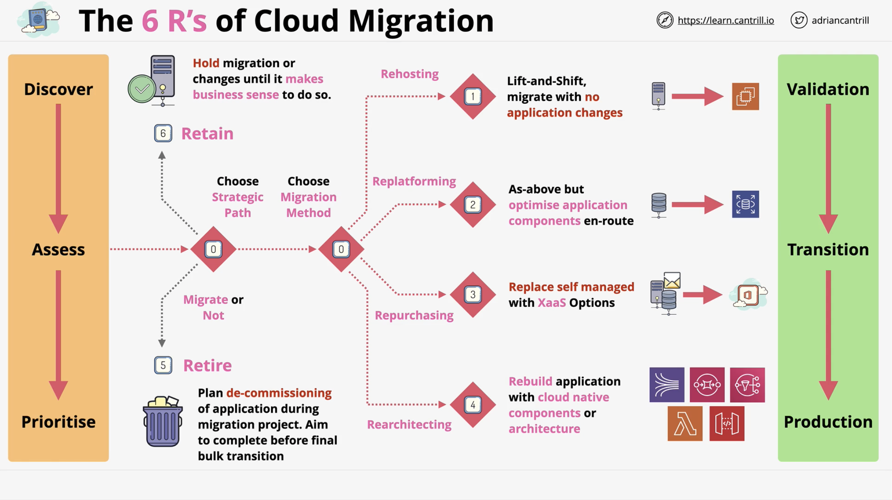

## Migrations & Extensions

> [!info] Moving workloads into AWS

### Six R's of Cloud Migration

>tldr; Rehosting, Replatforming, Repurchasing, Refatoring/Re-Architecting, Retire, Retain

Rehosting
- Lift and Shift
- E.g. VM to EC2
- Reduce admin overhead
- Potentially optimise usage costs
- Cost savings potentially
- Negative - not taking advantage of the cloud

Replatforming
- Lift and Shift with optimizations
- e.g. Moving from self-hosted DB to RDS
- e.g. Using ELB instead of self managed
- Doesn't involve huge changes, just better versions
- Some small benefits but nothing life changing
- Main benefit is reduced admin overhead

Repurchasing
- Move to something new e.g. SaaS
- Unless you have a reason to self manage... don't
- E.g. migrating to hosted email

Refactor / re-architect
- Take advantage of Cloud
- Upfront effort is high
- e.g. Microservice architecture
- e.g. API, Event-Driven, Serverless
- Good long term benefits with cost, scaling, resilience
- But big upfront effort

Retire
- Do we even need this?
- Why migrate a service that's not being used
- Migration is a perfect time to re-evaluate this
- Always use large scale migration to reduce clutter

Retain
- Don't move
- Old application might not be worth the effort
- Might be too complicated or high risk

### Database Migration Service (DMS)

> tldr; tool for migrating between databases

One of the instances needs to be in AWS

SCT (Schema Conversion Tool)
- only use when converting between engines
- sct works by converting db into a generic file format
- can be used with snowball devices

### Application Discovery Service

> tldr; discovery tool, allows you to discover what's running on-prem

Agentless - via integration with VMWare
- Performance and resource usage

Agent-based mode
- Gives much richer information
- Can see way more detail and dependencies between machines via network traffic

Integrates with AWS Migration Hub and Athena

#### SMS (Server Migration Service)

> tldr; migration tool; performs server migrations

Works with VMWare, HyperV, AzureVM

Can migrate in the background while VM is in use

Can orchestrate multi-server migrations

Integrates with AWS Migration Hub too

Requires connector e.g. into VSphere

==Exam: Agentless==

### Storage Gateway

> tldr; usually a vm but can be a physical appliance that runs on prem
> tldr; acts as a bridge between on-prem storage and stuff in aws

Presents storages as iSCSI, NFS, SMB

==Exam: Which Storage Gateway for which scenario?==

Volume stored = Block storage (e.g. iSCSI vol)
File = Actual file shares (nfs/smb)

#### Volume Stored Mode

Stored mode: SG VM Presents volumes to on-prem like a NAS or SAN

Source of truth = On-prem SG VM

Data is copied to AWS asynchronously via EBS snapshots

We have the data on-prem but a full copy in AWS

Great for DR

But doesn't extend on-prem capacity

#### Volume Cached Mode

On prem cache of the data stored in AWS

Block storage, not file

Source of truth = AWS

Storage 'appears' to be on-prem but it's not really

Note: Storage is in an AWS managed area, can't access it directly via s3, it's block storage

Can be used to add more storage than you have on-prem -- only the cache is local

#### Tape Gateway (VTL mode)

Equivalent of table backups for on-prem

VTL = Virtual Tape Library

Pretends to be an iSCSI tape library but the data is stored in S3 / Glacier

Presents it self like a tape loader to the backup software

Idea is few changes needed to the backup software

Or extend capacity

Also allows an existing physical tape library to be moved into AWS, and still seem like the backups are on tapes

Virtual tapes are stored using S3 up to 5TiB (S3 limit)

Limit: 1PB across 1500 virtual tapes

S3 = Virtual Tape Library (VTL)
Glacier = Virtual Tape Shelf (VTS)
#### File Mode

Bridges on-prem file shares and S3

Mount Points available over NFS or SMB

==Exam: If you see volumes mentioned, default to Volume Gateway, Tapes: VTL==

Runs on-prem with read/write caching

But the source of truth S3 not on prem

Files stored into a mount point and visible in S3 (unlike VGW)

The main thing that makes this awesome is mapping between on-prem and what we see in S3... if we browse S3 we'll see a representation of the folder/file hierachy

File paths are built into the file name

Because S3 is the store we get some big advantages:
- We can integrate with other AWS services (athena, lambdas)
- Multi DC site file share that hooks into the SG in File mode
	- Notify when uploaded: Feature to ensure multiple SGs are in sync
	- No support for object locking - can result in data loss if file is updated simultaneously
- S3 Replication to replicate the fileshare to other regions
- S3 Lifecycle rules
- On-prem shares benefit from all this

### Snowball Family

#### Snowball 

Older generation

> tldr; large physical appliances for moving data into AWS

Physical Storage: Suitcase sized or truck

Physical interaction with AWS
- Log a job and await delivery
- All data is encrypted using KMS
- 50TB device or 80TB device
- Usually economical compared to transferring over network to use if we have 10TB - 10PB of data
- You can order multiple devices to multiple sites
	- Massively parallel way to ingest data
- Device only includes storage

#### Snowball Edge

Newer Gen - Includes storage and compute

Larger compacity than regular Snowball

Different Types:

Storage Optimzed (with EC2)
Compute Optimized - more cpu and storage 
Compute with GPU

#### Snowmobile

> tldr; Literally a truck

Up to 100PB per mobile

Not economical for smaller than 100TB or if data is spread across multiple sites (only one truck at one location)

### DataSync

> tldr; data transfer service for moving data in and out of aws

Designed for huge scale

Each agent can handle 10GiB/s ~ 100TB per day

Handles transfer of metadata - permissions and timestamps

Incudes built in data validation by default

Has bandwidth limiters

Automatic recovery from transmit errors

Pay as you use service

DataSync agent runs on a virtualisation platform like VMware and communicates with AWS DataSync Endpoint

==Exam: Look for reliable transfer of data, integration with EFS, FSx, S3 and support bi-directional / incremental or scheduled transfer it's likely to be DataSync==

Works a bit like DMS
- Task
- Source /Destination

Choose DataSync if you need a product to manage transfers that's not physical

